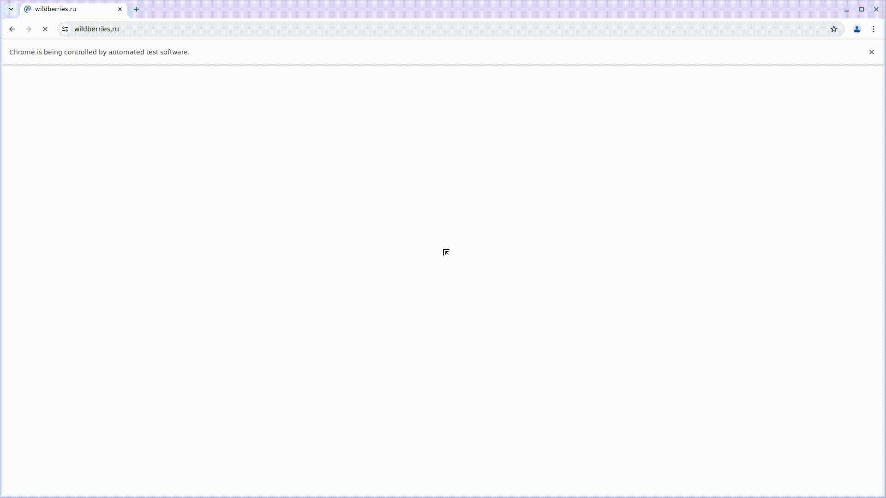

# Проект по тестированию интернет-магазина "https://www.wildberries.ru/"

---
### Список проверок, реализованных в web автотестах
1. Открытие чата 'Поддержка Wildberries'.
2. Смена валюты с российского рубля на казахский тенге и обратно.
3. Поиск товара по артикулу.
4. Поиск товара по фильтру.
5. Добавление товара в избранное.
6. Добавление товара в корзину.
7. Удаление товара из корзины.

---

### Используемые инструменты
         
поменять в папке лого (добавить правильную концовку как пайтон)
---

### Запуск автотестов осуществляется с использованием Jenkins
> [Ссылка на сборку в Jenkins](https://jenkins.autotests.cloud/job/hw_14_July_Project_last/)

#### Для запуска автотестов в Jenkins
1. Открыть [задачу в Jenkins](https://jenkins.autotests.cloud/job/hw_14_July_Project_last/)

 скрин из дженкинса главная страница

2. Нажать "**Build Now**".

---

### Allure отчет

#### Общие результаты
 #добавить скрин

#### Результаты прохождения тестов
 #добавить скрин

#### Графики
 #добавить скрин

---

### Уведомления в Телеграм

 #добавить скрин

---

### Прохождение автотеста

